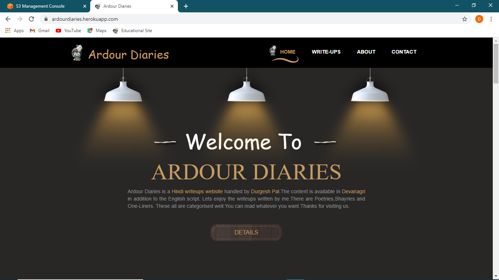
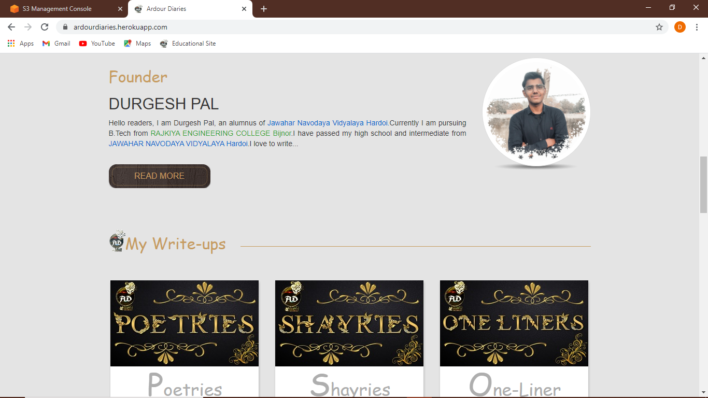
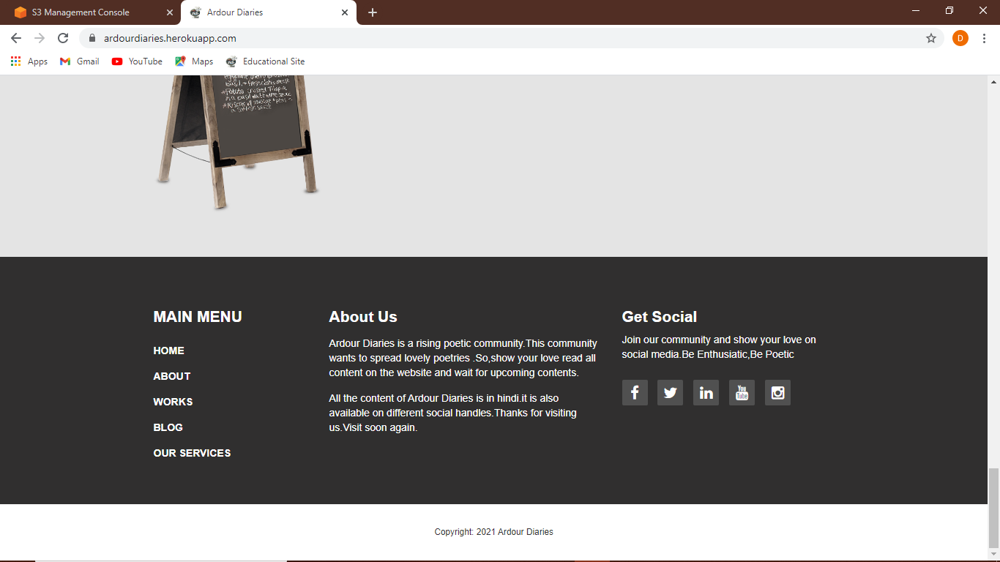
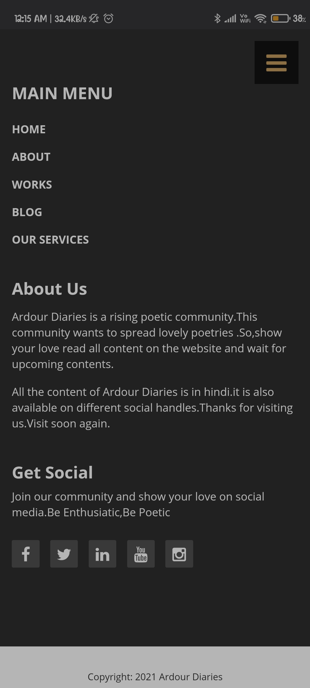

# ardour-diaries
  **Ardour Diaries** is a poetic page  running at different social media handles since 2020. This is a web project to build website for my content page.
  
  ---
  
  # DESKTOP VIEW

- view 1



- view 2

  

- view 3

  

  ---


# MOBILE VIEW

- **view 1**

  

- **view 2**

  


---

## Links:

- [Facebook](https://www.facebook.com/Ardour-Diaries-102409011153944)
- [Twitter](https://twitter.com/Durgesh66981372)
- [Instagram](https://www.instagram.com/desi_syahi/)

---

## Project Status

- Completed

## Project Details

This project is built on the *Django Framework(3.0)*. This project is build by [Durgesh Pal](https://www.linkedin.com/in/durgesh-pal-2001/) in the guidance of seniors of [Developer Student Club REC Bijnor](https://www.dscrecbijnor.com)


---

## Developement

### Running the Server

1. Run the following command to activate the environment:

  ```bash
  cd path/to/dir
  pip install pipenv
  pipenv shell
  ```
2. After that install all dependancies specified in Pipfile or Pipfile.lock :

  ```
  pipenv sync
  ```
3. Run the server using :
  ```
  python manage.py runserver 8000
  or
  pipenv run python manage.py runserver
  ```
  here 8000 is port number. you can use any port number you want.

4. To install any package :
  ```
  pipenv install package_name
  pipenv update  //run this at last
  ```
  It will automaticlly install the package and put it into requirements.
